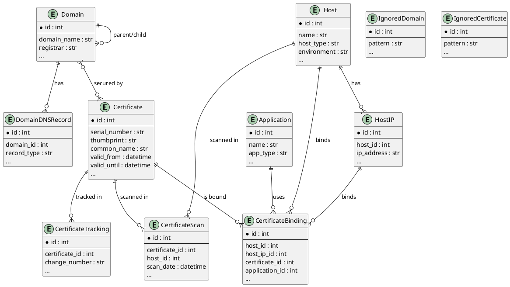
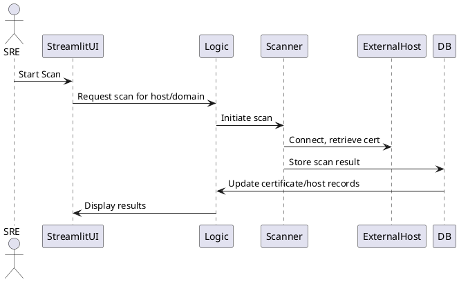
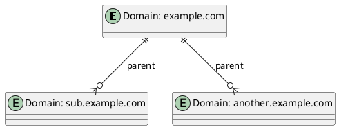
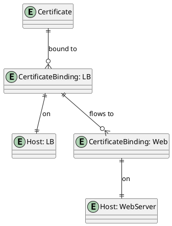

# Infrastructure Management System – Formal Design Document

## 1. Introduction

The Infrastructure Management System (IMS) is a comprehensive, web-based platform for tracking and auditing SSL/TLS certificates, hosts, and domains across diverse infrastructure components. It is designed to provide visibility, automation, and control over certificate lifecycles, host associations, domain information expirations, and compliance requirements. **IMS does not automate certificate replacement, infrastructure modification, or certificate creation. It is strictly a tracking and auditing tool.**

---

## 2. System Overview

- **Type:** Web-based application
- **Primary Users:** SREs
- **UI Framework:** Streamlit
- **Database:** SQLite (SQLAlchemy ORM)
- **Configuration:** YAML-based, with environment variable overrides
- **Core Features:** Certificate, domain, and host tracking; historical tracking; export/reporting; alerting; and configuration management. **No automation of certificate replacement, infrastructure changes, or certificate creation.**

---

## 3. Architecture

### 3.1 High-Level Structure

- `infra_mgmt/` – Main application logic, models, views, and components
- `data/` – Persistent storage (certificates, backups)
- `tests/` – Unit and integration tests
- `exports/`, `reports/` – Data and report outputs
- `run.py`, `run_custom.py` – Application entry points

### 3.2 Key Components

- **Models:** SQLAlchemy ORM models for certificates, hosts, domains, bindings, applications, and tracking
- **Scanner:** Modular scanning engine for certificates and domains
- **Views:** Streamlit-based UI for dashboard, certificates, hosts, applications, scanning, search, history, and settings
- **Settings:** YAML configuration management with web-based editor
- **Exports/Reports:** PDF/CSV export, customizable templates
- **Monitoring/Notifications:** Alerting for certificate expiry, scan failures, and system events

### 3.3 Data Flow

1. **User Input:** Users interact via Streamlit UI (scan, manage, search, configure)
2. **Processing:** Actions trigger business logic (scanning, updating, exporting)
3. **Persistence:** Data is stored/retrieved from SQLite via SQLAlchemy models
4. **Output:** Results are displayed in UI, exported, or logged

### 3.4 Control Flow

- Single-page Streamlit app with sidebar navigation
- Each view is routed based on user selection
- Session state manages scanner, database engine, and UI state

---

## 4. Data Model

### 4.1 Core Entities

- **Certificate:** Tracks all certificate metadata, validity, SANs, usage, and scan history. **IMS does not create or replace certificates.**
- **Host:** Represents physical/virtual hosts, with type, environment, and IPs
- **HostIP:** IP addresses associated with hosts
- **CertificateBinding:** Maps certificates to hosts, IPs, applications, and platforms
- **Application:** Tracks applications using certificates
- **Domain:** Manages domain names, registration, DNS, and certificate associations
- **CertificateScan:** Records scan events and results
- **CertificateTracking:** Tracks lifecycle events (renewals, changes, replacements as tracked events only)
- **DomainDNSRecord:** DNS records for domains
- **IgnoredDomain/Certificate:** Patterns to exclude from scanning/management

### 4.2 Relationships

- One-to-many: Host → HostIP, Host → CertificateBinding, Certificate → CertificateBinding
- Many-to-many: Domain ↔ Certificate (via association table)
- Hierarchical: Domain (parent/child for subdomains), CertificateBinding (parent/child for flow)

---

## 5. Key Features

### 5.1 Certificate Management

- View, search, and filter certificates
- Detailed certificate info (serial, thumbprint, SAN, issuer, etc.)
- Track status (active, expired, pending renewal)
- Associate with hosts, domains, applications
- **Track, but do not automate, certificate replacement or creation**

### 5.2 Scanning & Monitoring

- Scan hosts/domains for certificates (internal/external)
- Auto-associate discovered SANs and hostnames
- Track scan history, last seen, and scan status
- Alert on approaching expiration, scan failures

### 5.3 Infrastructure Mapping

- Map certificates to hosts, IPs, domains, and applications
- Visualize certificate flows and dependencies

### 5.4 Export & Reporting

- Export data as CSV/PDF
- Customizable report templates
- Timeline and chart visualizations

### 5.5 Configuration Management

- YAML-based config with web editor
- Multiple config locations (local, user, system)
- Environment variable overrides
- Scanning profiles, alert thresholds, backup settings

### 5.6 Backup & Restore

- Automated and manual backups (database, config)
- Backup manifests and verification

---

## 6. Security Model

- No authentication/authorization in base version (assume trusted environment)
- Sensitive data (certificates, keys) stored in SQLite, not encrypted by default
- Planned: Role-based access, audit logging, secure secret management

---

## 7. Error Handling & Resilience

- Robust error handling in scanning, database, and export operations
- Logging via Python logging module
- Alerting for critical failures (scan, backup, config)
- Planned: Transaction-safe imports, rollback, audit trail

### 7.1 Exception Hierarchy and Error Handling Standards

IMS uses a custom exception hierarchy defined in `infra_mgmt/exceptions.py` to ensure robust, traceable, and domain-specific error handling across all modules. All domain-specific errors should raise a custom exception, never the base `Exception` class. This enables:

- Consistent error handling and logging
- Easier debugging and user feedback
- Clear separation of error types for different subsystems

**Exception Classes:**

| Exception Class      | Purpose/Domain                        | Example Usage                                      |
|---------------------|---------------------------------------|----------------------------------------------------|
| AppError            | Base for all IMS errors                | `raise AppError("General error")`                  |
| DatabaseError       | Database operation failures            | `raise DatabaseError("Invalid DB path")`           |
| BackupError         | Backup/restore operation failures      | `raise BackupError("Failed to create backup")`      |
| ScannerError        | Certificate/domain scan failures       | `raise ScannerError("Could not resolve host")`      |
| CertificateError    | Certificate-specific errors            | `raise CertificateError("Certificate expired")`     |
| NotFoundError       | Resource not found                     | `raise NotFoundError("Domain not found")`          |
| PermissionError     | Permission denied                      | `raise PermissionError("No write permission")`      |

**Guidelines:**

- Always raise the most specific exception for the error domain.
- Catch custom exceptions in business logic and views for user-friendly error reporting.
- Only catch base `Exception` for truly unexpected errors, and log them as critical.
- Extend the exception hierarchy as new domains/features are added.

**Reference:** See `infra_mgmt/exceptions.py` for full documentation and usage examples.

---

## 8. Performance & Scalability

- Designed for small-to-medium scale (single SQLite DB, Streamlit UI)
- Efficient data handling in AG Grid tables
- Planned: Multi-instance support, database locking, concurrent access handling

---

## 9. Testing Strategy

- Extensive unit tests for models, views, scanner, and settings
- Integration tests for scan process and data flows
- Test data for backup/restore and edge cases
- Coverage for error scenarios and edge cases

---

## 10. Build & Deployment

- Python 3.8, Streamlit, SQLAlchemy, PyYAML
- Install via `requirements.txt` (online/offline)
- Run via `run_custom.py` or `streamlit run run.py`
- Configurable port and environment
- Deployment: Localhost or internal server

---

## 11. Configuration & Customization

- All major settings in `config.yaml`
- Database and backup paths, scanning profiles, alert thresholds, export settings
- Web-based settings editor for live changes

---

## 12. Planned Enhancements

- Data synchronization (multi-environment, incremental updates, conflict resolution)
- Advanced certificate validation (chain, revocation, OCSP)
- Full-text search, bulk actions, enhanced filtering
- CA management, JWT certificate support, domain lifecycle management
- Multi-instance deployment, robust locking, audit trail

---

## 13. Known Limitations

- No built-in authentication/authorization
- Single-user, single-instance by default
- SQLite may not scale for very large deployments
- No encrypted storage for sensitive data
- Some advanced features are planned but not yet implemented
- **IMS does not automate certificate replacement, infrastructure modification, or certificate creation.**

---

## 14. Documentation Standards & Function-Level Documentation

### 14.1 Traceability and Consistency

- All documentation must be kept in sync with the codebase.
- Major features, modules, and public interfaces must be documented in this design document and referenced in code docstrings.
- Changes to code should be reflected in documentation and vice versa.

### 14.2 Function-Level Documentation Standards

Every function, method, and class should include a docstring that covers:

- **Purpose:** What the function does and why it exists
- **Parameters:** List and describe all input parameters, including types and expected values
- **Returns:** Describe the return value(s), including type and meaning
- **Raises:** List possible exceptions/errors and under what conditions they are raised
- **Side Effects:** Any changes to state, files, databases, or external systems
- **Examples:** (Where appropriate) Provide usage examples for complex or public functions
- **Edge Cases:** Document how the function handles unusual or error conditions

#### Example Docstring Template (Google Style)

```python
    def example_function(param1: int, param2: str) -> bool:
        """
        Brief summary of what the function does.

        Args:
            param1 (int): Description of the first parameter.
            param2 (str): Description of the second parameter.

        Returns:
            bool: Description of the return value.

        Raises:
            ValueError: If an invalid value is provided.

        Example:
            >>> example_function(1, "foo")
            True
        """
```

### 14.3 Expectations

- All public functions and classes must have complete docstrings.
- Private/internal functions should have at least a brief description.
- Docstrings must be updated with any change to function signature or behavior.
- Documentation reviews are part of the code review process.

### 14.4 Custom Exceptions and Error Handling

- Major features, modules, and public interfaces must be documented in this design document and referenced in code docstrings.
- Changes to code should be reflected in documentation and vice versa.
- **All custom exceptions and error handling patterns must be documented and referenced in both code and this design document.**

---

## 15. Diagrams & Visuals

### 15.1 Entity-Relationship Diagram (ERD)

The following PlantUML diagram describes the main data model relationships in IMS:



---

### 15.2 High-Level System Architecture

This diagram shows the main components and their interactions:

```plantuml
@startuml
actor "SRE" as User

User --> StreamlitUI : interacts

component "Streamlit UI" as StreamlitUI
component "Business Logic" as Logic
database "SQLite DB" as DB

StreamlitUI --> Logic : triggers actions
Logic --> DB : reads/writes data

component "Scanner" as Scanner
Logic --> Scanner : initiates scans
Scanner --> DB : stores scan results

component "Config (YAML)" as Config
StreamlitUI --> Config : reads/updates settings

@enduml
```

---

### 15.3 Data Flow: Certificate Scan

This sequence shows the flow for a certificate scan operation:



---

### 15.4 Example: Domain and Subdomain Hierarchy

This diagram illustrates parent/child domain relationships:



---

### 15.5 Example: Certificate Binding Flow

This diagram shows how a certificate can be bound to a load balancer and then to a backend server:



---

## 16. References

- [README.md](README.md)
- [config.yaml](config.yaml)
- [infra_mgmt/models.py](infra_mgmt/models.py)
- [infra_mgmt/app.py](infra_mgmt/app.py)
- [tests/](tests/)

---

*This document is a living artifact. Please review, annotate, and update as necessary for your team's needs.*
